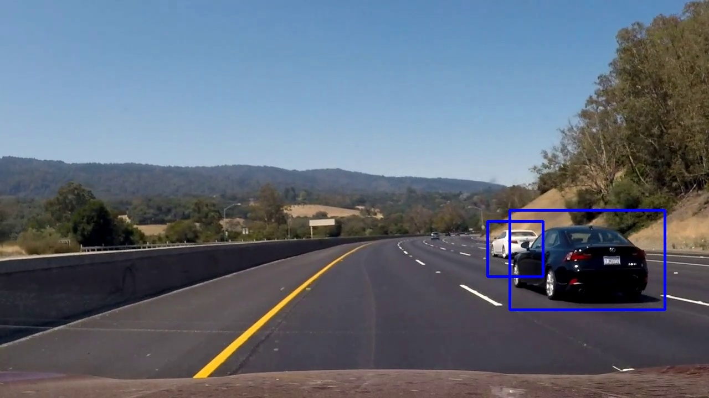

# Vehicle Detection

The goal of this project is to build a pipeline to detect vehicles in a video. The whole process is divided into two steps:
1. Given a set of car and not-car images, train a classifier to recognize whether an image is a car.
2. For each frame of the video, slide the searching windows with certain scales to detect if the car is contained in these windows. Finally, combine the positive windows and output the bounding box around each car in the frame.

Since we need to run the classification process on a lot of searching windows. The classifier is supposed to be fast. In this case we use *linear support vector classifier*. Because the real distribution of not-car case is very complicated, our classifier will be not very good. It will throws a bunch of false positives (car detected where there aren't actually car). To make the pipeline more robust, people usually performs a *hard negative mining*. It means that the falsely detected patches will be added to training set and the classifier will be retrained. Because apart of not-car images in the dataset is extracted  from project video, we will not do the hard negative mining here. Alternatively, we will combine the detections of several consecutive frames to filter out the false positives. Let's dig into the detailed implementation.

[//]: # (Image References)
[image1]: ./report_images/GTI_left.png
[image2]: ./report_images/GTI_right.png
[image3]: ./report_images/GTI_MiddleClose.png
[image4]: ./report_images/GTI_Far.png
[image5]: ./report_images/KITTI_extracted.png

[image6]: ./report_images/not_car_GTI_1.png
[image7]: ./report_images/not_car_GTI_2.png
[image8]: ./report_images/not_car_extras_1.png
[image9]: ./report_images/not_car_extras_2.png
[image10]: ./report_images/not_car_extras_3.png

[image11]: ./report_images/Y.jpg
[image121]: ./report_images/Cr.jpg
[image122]: ./report_images/Cb.jpg

[image13]: ./report_images/car_col_hist.jpg
[image14]: ./report_images/notcar_col_hist.jpg

[image15]: ./report_images/hog_car.jpg
[image16]: ./report_images/hog_notcar.jpg

[image18]: ./report_images/car_detection_process.jpg

[image19]: ./report_images/occluded_car.jpg
[image20]: ./report_images/occluded_car_2.jpg
[image21]: ./report_images/occluded_car_3.jpg

## Building classifier

The code of this part is in file `svm_classify.py`

### Dataset
These datasets are comprised of images taken from the [GTI vehicle image database](http://www.gti.ssr.upm.es/data/Vehicle_database.html), the [KITTI vision benchmark suite](http://www.cvlibs.net/datasets/kitti/), and examples extracted from the project video itself. You can directly download the project dataset for [vehicles](https://s3.amazonaws.com/udacity-sdc/Vehicle_Tracking/vehicles.zip) and [non-vehicles](https://s3.amazonaws.com/udacity-sdc/Vehicle_Tracking/non-vehicles.zip). There are total 8792 car images and 8968 not-car images.

| GTI left           |GTI right           |    GTI middle      | GTI far            | KITTI_extracted   |
|--------------------|--------------------|--------------------|--------------------|-------------------|
|![alt text][image1] |![alt text][image2] |![alt text][image3] |![alt text][image4] |![alt text][image5]|

| GTI not-car        |GTI not-car         | From project video | From project video |From project video |
|--------------------|--------------------|--------------------|--------------------|-------------------|
|![alt text][image6] |![alt text][image7] |![alt text][image8] |![alt text][image9] |![alt text][image10]|

### Feature extraction

#### Color channel
We decided to converted images to `YCrCb` channel for further exploration.

| Original image     | Y cahnnel | Cr cahnnel  | Cb channel|
|--------------------|--------------------|--------------------|------|
|![alt text][image5] |![alt text][image11] |![alt text][image121] |![alt text][image122]

#### Subsample
The first feature is a subsample of the image itself. The image was resized to (32,32) and convert to a single vector using `numpy.ravel()`. The subsample feature is extracted by function `bin_spatial()` lines 35-41.

#### Color histograms
The second feature is color histogram. The histogram of all three color channels were used and divided into 32 bins (see function `color_hist()` lines 44-52)

| Original image     | color histogram |
|--------------------|--------------------|
|![alt text][image5] |![alt text][image13] |

| Original image     | color histogram |
|--------------------|--------------------|
|![alt text][image8] |![alt text][image14] |

#### HOG
The last but most important feature is histogram of gradients (HOG). HOG is calculated in the original images of size (64,64) and in all three channels with 9 orientations, 8 pixels per cell, 2 cells per block (function `get_hog_features()` lines 15-32).

![alt text][image15]
![alt text][image16]

#### Train the classifier
All the features above were reshaped and concatenated into a single feature vector. For classifier, we used *linear support vector classifier* (SVC for sort) which was done by  `sklearn.svm.LinearSVC()` from `sklearn` library (lines 147-155). Before training, we scaled the feature by using `sklearn.preprocessing.StandardScaler()` (lines 131-133). We trained the classifier on 90% of the data and obtained 99.49% accuracy on the rest 10% validation data. After training the SCV and scaler were dumped to a pickle file for later use in detection process.

## Detection process
The code of this part is in file `car_detector.py`

### Single image detection
(See function `sigle_image_process()` lines 195-213)

As mentioned above, in order to detect the cars in a image, we slide searching windows through the images and run the saved SCV on each window. The detail is following:
1. The windows were sliding in a region of interest in the bottom of image ( `image[380:636,:]`)
2. We used two window size 64x64, 80x80 with 75% overlapping in each axis.
3. In order to avoid recalculating HOG feature on each searching window, we calculated the HOG feature of the whole image and crop the region inside the windows when needed. More precisely, we fixed the size of searching window which is 64x64, and the parameters of HOG features (9 orientations, 8 pixels per cell, 2 cells per block). When we need a searching window in a different size, we resized the image instead of resizing searching window (implemented in function `find_car()` lines 91-169).      
4. To filter out the false positives, we used a global heat map which initiated as a zero matrix. When we got a positive window, the value of the heat map in that window was increased by 1. At the end, we kept only the region whose maximal heat map value is greater than or equal to 2.

| Sliding multi-scale windows, combining positive results, thresholding heat map and output bounding box      |
|--------------------|
|![alt text][image18]|

### Video detection
The whole process of video detection is implemented in function `video_car_process()` lines 217-297.

The video detection process also used searching window technique. However, we made some modification to take advantage of the cars detected from previous frames.

#### 1. Summing up the heat map of several consecutive frames
The video process also used two window size 64x64, 80x80 with 75% overlapping in each axis. In order to effectively reduce false positives, we summed up the heat maps from 10 consecutive frames and filtered out all the region having the maximal heat map value less than 30.  

#### 2. Keep track of detected cars
We observed that the heat map technique can't separate well a car which is partially occluded by another. Especially, when summing up the heat maps from several consecutive frames, we came up with a long window which contained two separated cars.

![occluded_car][image19]

To solve this problem, we use class `Car()` (lines 14-68) to keep track of detected cars.
* When a positive window is found, if it intersected with the bounding box of detected cars. It was added to the heat map of the car having maximal intersection area with this box. If the positive box didn't belong to any car, it was assigned to the total heat map of the frame to detect new cars.

* When one car was lost, we calculated the intersection area of its bounding box with other cars to determine if it was occluded by another car. If it was, the occluding car was marked.

* If a car was marked as a occluding car, in each frame when its heat map was created, we checked if its heat map had two connected components. If it was the case, we converted that car into two separated cars.

Here is the results of occluding case:

| Before occluding     | After occluding |
|--------------------|--------------------|
|![alt text][image20] |![alt text][image21] |

## Results
The test image results are in folder `test_images`, the video results are in folder `test_videos`

Here's a [link to my project video result](./test_videos/project_video_result.mp4)

## Discussion
The model should be tested on different types of roads, especially when there are more than one car occluded by another. It would be more challenge if Udacity provide a different video for robust testing and let students do the hard negative mining by themselves.    

The linear support vector classifier is not a good classifier in image classification problem. We used SVC because it is quite fast for sliding window technique. But even that our detection process worked pretty slow (about 0.71 fps). The code should be optimized and re-implement in C++ for better efficiency.   

A more recent approach for this problem is that instead of running searching windows in whole frame, a set of potential regions are proposed. Because of fewer regions to classify, we can use a stronger classifier such as a deep convolution neural network. A state of art of this approach is Faster R-CNN model with speed 7fps. This approach is also the benchmark in term of accuracy in the object detection problem.

Another approach which trades off a little bit of accuracy but can run in real time is single shot approach. The idea is to treat object detection problem as a combining of classification and regression problems by using a set of default bounding boxes. This is an end-to-end convolution neural network training and outputting the probability of classes in which each default box belongs to together with the offsets of each default box comparing to the real bounding box. The two main models for this approach are SSD (Single Shot MultiBox Detector) and Yolo (You only look once). It would be a great experience to re-implement and train those types of models using KITTI and the recent released Udacity dataset.       
